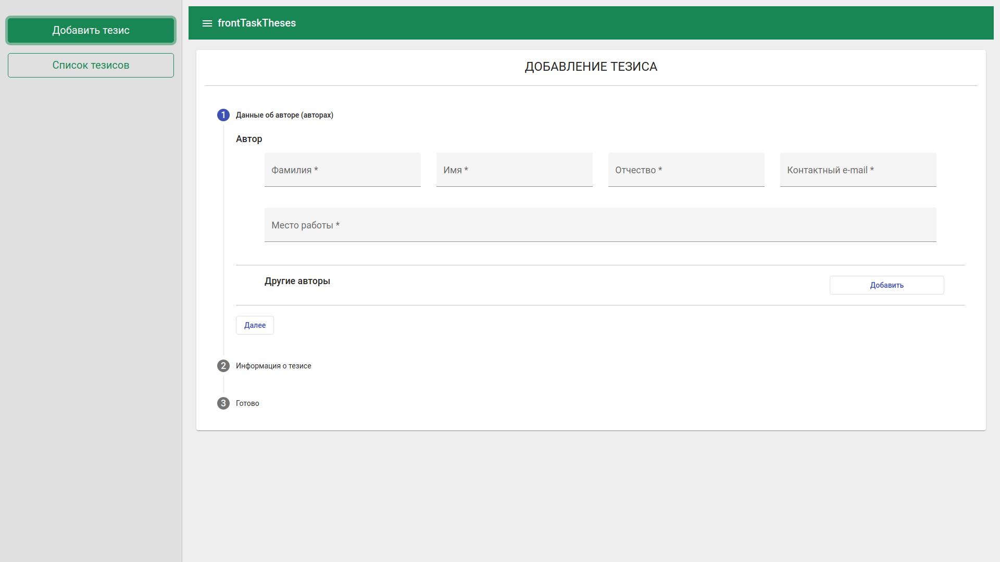
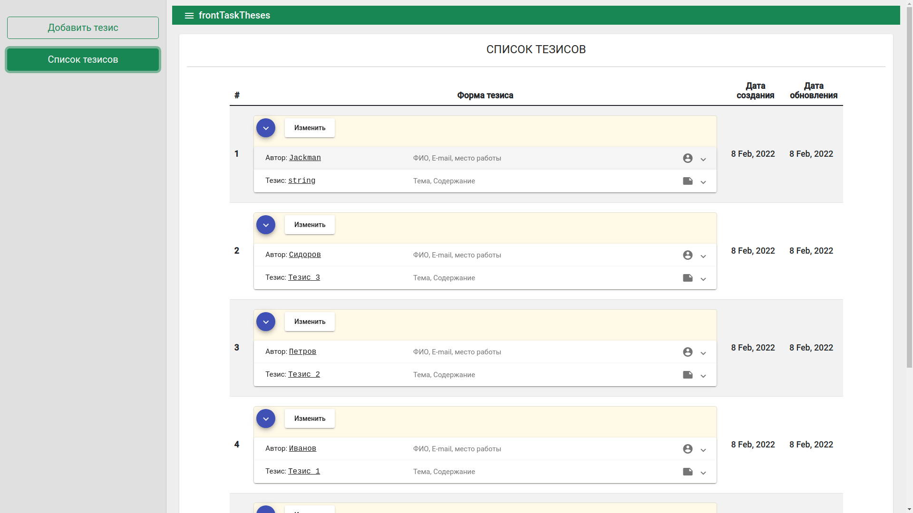

# FrontTask

Для имитации взаимодейтсвия с БД (сервером) был использован [JSON Server](https://github.com/typicode/json-server#getting-started)

>Инструкция по запуску приложения
(предварительно установить node.js | Angular CLI)
1) В корне проекта запутить терминал и выполнить следующие команды:
```
npm install
npm install -g json-server
json-server --watch db.json --routes routes.json
```
2) Открыть ещё один терминал в корне проекта и выполнить команду:
```
ng serve --open
```


>В корне проекта лежит файл <b>db.json</b> - он и будет условной БД.

>Наша БД будет доступна по ссылке http://localhost:3000/

##СКРИНЫ



# Angular Test Task

## Порядок выполнения

1. Форкнуть репозиторий
2. Добавить CONTRIBUTORS.md со своими ФИО и email
3. Сделать задание
4. Сделать pull-request к данному репозиторию

## Задание

Сделать веб-приложение на Angular для добавления и просмотра тезисов с использованием внешнего API.

API доступно по ссылке:
https://conf.antibiotic.ru/demo/api

Интерфейс Swagger с примерами работы с API доступен по ссылке
https://conf.antibiotic.ru/demo/swagger/index.html

Можно использовать любые фреймворки для оформления: Angular Material, PrimeNg, Bootstrap, Tailwind, и т.д.

По итогу приложение должно обеспечивать:
- Добавление нового тезиса
- Просмотр списка добавленных через форму тезисов
- Просмотр подробной информации об одном добавленном тезисе
- Редактирование информации об одном добавленном тезисе
- Если при отправке формы на сервер возникла ошибка, то она должна отображаться на экране.


### Пример формы заполнения


